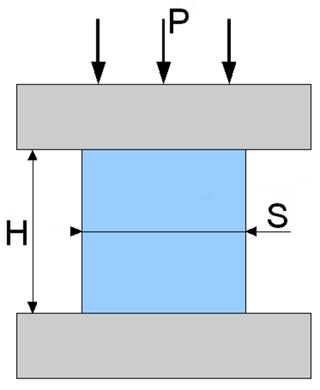
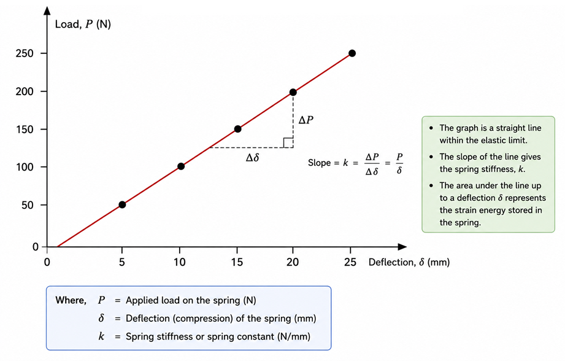

### Physical Concept

A spring is an elastic machine element that deforms under an applied load and regains its original shape when the load is removed, provided the elastic limit is not exceeded. Compression springs are designed to resist compressive forces by storing mechanical energy in the form of elastic strain energy.

When an axial compressive force acts on a close-coiled helical spring, each coil experiences twisting. Thus, although the external load is compressive, the spring wire is primarily subjected to **torsional shear stress**.

<b>Figure 1. Close-coiled helical compression spring subjected to an axial compressive load.</b>

### Everyday Intuition

Compression springs are commonly encountered in everyday engineering applications such as:

- Vehicle suspension systems
- Railway buffers
- Mechanical shock absorbers
- Ballpoint pens
- Weighing balances
- Mechanical valves
- Industrial vibration isolators

In all these applications, the spring compresses under load, stores elastic energy, and returns to its original shape when the load is removed.

### Experimental Relevance

The compression test is performed to study how a spring behaves under gradually increasing compressive loads. The experiment helps determine:

- Spring deflection under different loads
- Spring stiffness (spring constant)
- Strain energy stored within the elastic range
- Load–deflection relationship

For an elastic spring, the applied load is directly proportional to the deflection, thereby verifying **Hooke's law**.

A typical load–deflection relationship for a linear elastic spring is shown below.

<b>Figure 2. Typical linear load–deflection curve for a compression spring.</b>

The straight-line relationship indicates that the spring stiffness remains constant throughout the elastic region. If the applied load exceeds the elastic limit, the spring may undergo permanent deformation and no longer return to its original length.

### Mathematical Formulation

According to Hooke's law,

$$
W = k\delta
$$

where

- $W$ = Applied load (N)
- $k$ = Spring stiffness or spring constant (N/mm)
- $\delta$ = Spring deflection (mm)

Therefore,

$$
k = \frac{W}{\delta}
$$

The elastic strain energy stored in the spring is

$$
U = \frac{1}{2}W\delta
$$

or equivalently,

$$
U = \frac{1}{2}k\delta^{2}
$$

For a close-coiled helical spring,

$$
\delta = \frac{8WD^{3}n}{Gd^{4}}
$$

where

- $D$ = Mean coil diameter
- $d$ = Wire diameter
- $n$ = Number of active coils
- $G$ = Modulus of rigidity of the spring material

This expression shows that spring deflection increases with load and coil diameter, whereas increasing the wire diameter greatly increases the spring stiffness.

### Apparatus-Specific Application

In the compression spring testing machine, the spring is placed between two compression plates. A gradually increasing axial load is applied while the corresponding deflection is measured.

The measured data are later used to determine the spring stiffness, strain energy, and load–deflection characteristics of the spring.

### Engineering Significance

Compression springs are widely used wherever controlled force, energy storage, or vibration isolation is required. Typical engineering applications include:

- Automobile suspension systems
- Railway suspension assemblies
- Shock absorbers
- Industrial machinery
- Mechanical valves
- Aircraft landing gear
- Precision instruments
- Energy storage mechanisms

Understanding the load–deflection behaviour and stiffness of springs enables engineers to design reliable mechanical systems that operate safely within the elastic range.
